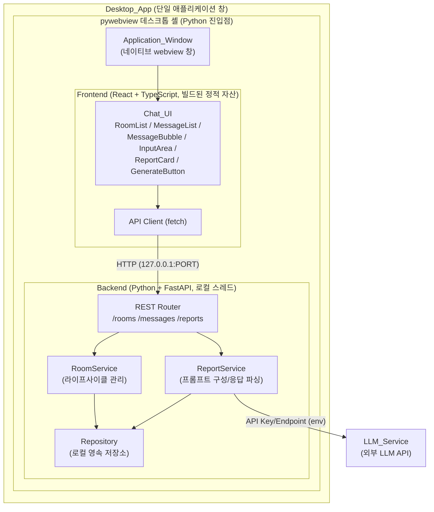
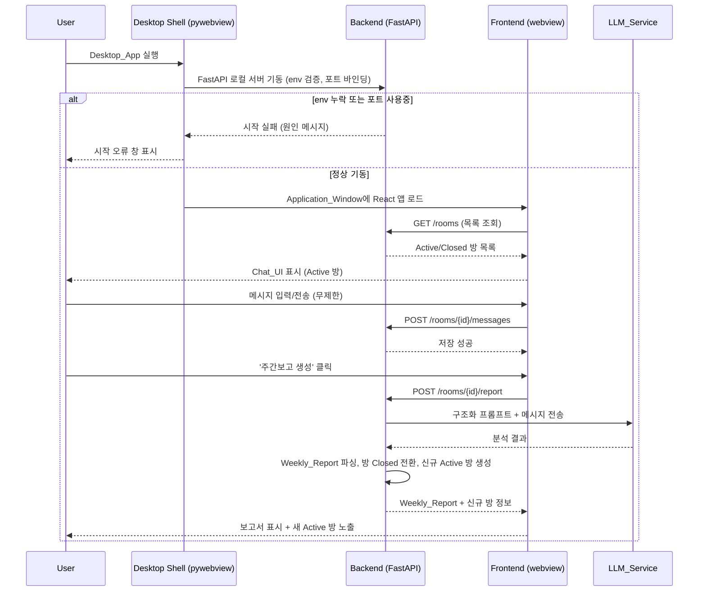
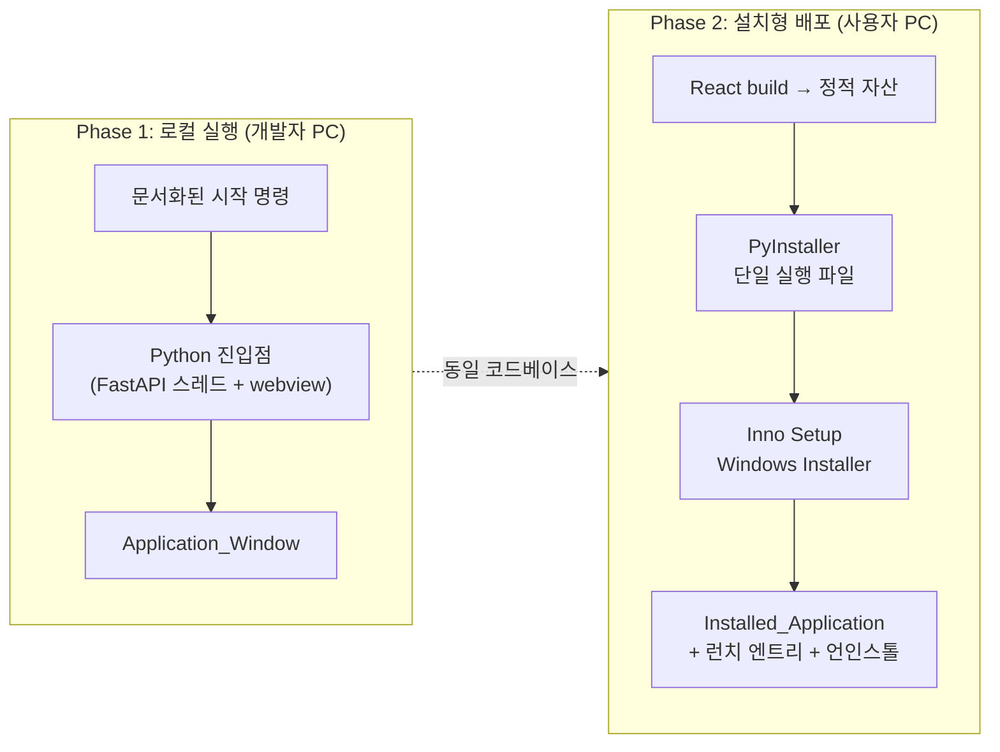

# Design Document

## Overview

본 문서는 `weekly-report-chat` 기능의 기술 설계를 정의한다. 이 애플리케이션은 카카오톡 데스크톱 클라이언트와 같이 **자체 네이티브 애플리케이션 창(Application_Window)을 갖는 단일 독립 실행형 데스크톱 애플리케이션(Desktop_App)**이다. 사용자는 웹 브라우저에서 URL로 접속하지 않으며, 하나의 앱을 실행하면 카카오톡 스타일의 채팅 UI가 데스크톱 창으로 열린다.

사용자는 로그인 없이 자유롭게 채팅 메시지를 입력하고, '주간보고 생성' 버튼을 누르면 LLM이 전체 채팅 내용을 분석하여 구조화된 주간보고서(Weekly_Report)를 생성한다. 보고서가 생성되면 해당 채팅방은 종료(Closed) 상태가 되어 읽기 전용으로 전환되고, 새로운 Active 채팅방이 자동으로 생성된다.

내부적으로는 다음 두 구성 요소를 하나의 데스크톱 앱으로 통합한다.

- **Frontend**: React + TypeScript 기반 UI 계층. 브라우저 탭이 아닌 데스크톱 창(webview) 내부에 렌더링된다.
- **Backend**: Python + FastAPI 기반 로컬 REST API 서버. 채팅방/메시지 관리, LLM 연동, 보고서 생성 로직을 담당한다.

전달(delivery)은 두 단계로 구성되며, 두 단계 모두 최종 형태는 **하나의 데스크톱 앱 창**이다.

- **Phase 1 (1차 완료)**: 개발자 PC에서 로컬로 실행. 문서화된 시작 명령으로 내부 Frontend와 Backend를 함께 구동하되 사용자에게는 브라우저 없이 하나의 데스크톱 창으로 제공한다.
- **Phase 2 (2차 완료)**: 단일 Windows 설치 파일(Installer)로 패키징. 개발 도구 설치 없이 일반 사용자 PC에 설치하여 데스크톱 앱으로 실행한다.

### 설계 목표 요약

| 목표 | 설명 | 관련 요구사항 |
|------|------|----------------|
| 네이티브 데스크톱 창 | 브라우저가 아닌 자체 앱 창으로 제공 | 1, 2, 10, 11 |
| 자유 채팅 | 형식 제약 없는 무제한 메시지 입력 | 3 |
| LLM 기반 보고서 생성 | 채팅 분석 후 구조화된 보고서 산출 | 4, 5, 9 |
| 채팅방 라이프사이클 | 생성 후 Closed 전환 및 신규 방 자동 생성 | 6, 7 |
| 로컬 통합 실행 | Frontend+Backend 동시 구동 | 8, 10 |
| 설치형 배포 | 단일 Windows 설치 파일 | 11 |

---

## Architecture

### 데스크톱 셸(Desktop Shell) 선택

브라우저 없이 React Frontend와 로컬 Python FastAPI Backend를 하나의 데스크톱 창으로 통합하기 위한 셸 기술을 비교한다.

| 후보 | 장점 | 단점 | Python 백엔드 통합 |
|------|------|------|----------------------|
| **pywebview** | Python 네이티브. FastAPI 백엔드와 동일 프로세스/언어 스택. PyInstaller로 단일 exe 패키징 용이. 의존성 최소 | 고급 네이티브 UI 커스터마이징 제한. OS 내장 webview 엔진에 의존 | 매우 우수 — 별도 sidecar 프로세스 관리 불필요 |
| **Tauri** | 매우 작은 바이너리, 보안성 우수, 성능 좋음 | Rust 툴체인 필요. Python 백엔드는 sidecar 바이너리로 별도 번들·관리 필요(복잡도 증가) | 보통 — Python을 별도 실행 파일로 동봉해야 함 |
| **Electron** | 성숙한 생태계, 크로스플랫폼, 풍부한 API | 번들 크기 큼(Chromium+Node). Python 백엔드는 별도 프로세스로 spawn·관리 필요 | 보통 — Node 셸이 Python 프로세스를 관리 |

**설계 기준(baseline): pywebview 채택.** 백엔드가 이미 Python(FastAPI)이므로, pywebview를 사용하면 단일 Python 진입점에서 (1) FastAPI 서버를 백그라운드 스레드로 기동하고 (2) 빌드된 React 정적 자산을 webview 창에 로드하는 구조를 하나의 언어 스택으로 구현할 수 있다. Phase 2에서 PyInstaller로 단일 Windows 실행 파일을 만든 뒤 Inno Setup(또는 유사 도구)으로 Installer를 생성하면, 별도 런타임 설치 없이 배포·설치·삭제(uninstall)까지 일관되게 처리할 수 있다. 이는 다국어 툴체인(Rust/Node) 관리 부담을 줄이고 패키징 경로를 단순화한다.

### 전체 구조도



핵심: 데스크톱 셸이 Frontend(webview 렌더링)와 Backend(로컬 FastAPI)를 하나의 앱 창 안에 감싸며, 외부 네트워크 통신은 LLM_Service 호출에 한정된다. Frontend와 Backend 사이 통신은 루프백 주소(`127.0.0.1`)의 로컬 HTTP로만 이루어진다.

### 실행 시퀀스 (앱 구동 → 보고서 생성)



### 배포 아키텍처 (두 단계)



---

## Components and Interfaces

### 데스크톱 셸 (Python 진입점)

애플리케이션의 부트스트랩을 담당한다.

- **책임**: LLM 환경 변수 검증 → FastAPI 서버를 백그라운드 스레드로 기동 → 로컬 포트 바인딩 확인 → pywebview 창 생성 및 React 자산 로드.
- **인터페이스(개념적)**:
  - `bootstrap() -> None`: 전체 부팅 절차 수행. 실패 시 셸 수준의 오류 창을 표시.
  - `start_backend(config) -> BackendHandle`: FastAPI 기동. env 누락/포트 충돌 시 `StartupError` 발생.
  - `open_window(url) -> None`: Application_Window 생성 후 로컬 Frontend URL 로드.

### Frontend 컴포넌트 (React + TypeScript)

| 컴포넌트 | 책임 | 관련 요구사항 |
|----------|------|----------------|
| `AppShell` | 전체 레이아웃(사이드바 + 메인 채팅 영역), 창 리사이즈 대응 | 2.6, 7 |
| `RoomList` | Active/Closed 채팅방 목록 표시 및 시각적 구분, 선택 시 방 전환 | 7.1–7.4 |
| `MessageList` | 메시지 스크롤 영역, 신규 메시지 시 자동 스크롤 | 2.5 |
| `MessageBubble` | 개별 메시지 렌더링. User(우측/구분 색상), 시스템 보고서(좌측/다른 색상), 타임스탬프 | 2.1–2.3 |
| `InputArea` | 텍스트 입력 + 전송 버튼. Enter 전송. 빈 메시지 차단. Closed 방에서 비활성화 | 3.1–3.3, 6.2, 6.6 |
| `GenerateButton` | '주간보고 생성' 버튼. Active 방에서만 노출. 메시지 없으면 차단·안내 | 4.1, 4.5 |
| `ReportCard` | 생성된 Weekly_Report를 섹션 포맷으로 표시, 복사 버튼 제공 | 5.4–5.6 |
| `LoadingIndicator` | 보고서 생성 대기 표시 | 4.4 |
| `ConnectionErrorBanner` | Backend 연결 불가 시 오류 표시 | 10.9, 11.6 |
| `apiClient` | Backend REST 호출 래퍼. 구조화 오류 응답 파싱 | 8, 9 |

### Backend 서비스 (Python + FastAPI)

- **RoomService**: 채팅방 생성/조회/목록, 상태(Active↔Closed) 전이, 보고서 성공 시 신규 Active 방 자동 생성.
- **MessageService**: 메시지 저장(시간순), 조회, 빈 메시지 방어.
- **ReportService**: 메시지 취합 → Report_Template 프롬프트 구성 → LLM 호출 → 응답을 Weekly_Report 구조로 파싱.
- **LLMClient**: 환경 변수(API Key/Endpoint) 기반 LLM API 연동. 타임아웃/오류 처리.
- **Repository**: 로컬 영속 저장소 접근 계층(방/메시지/보고서). 인메모리는 부적합 — 재시작 간 데이터 유지 및 Phase 2 설정 영속성(11.8) 필요.
- **Config**: 환경 변수 로딩 및 검증. 누락 항목을 이름으로 식별.

### REST API 인터페이스

기본 경로 `http://127.0.0.1:{PORT}`. 모든 오류는 아래 구조화 형식(Error Handling 참조)으로 반환한다.

| 메서드 & 경로 | 설명 | 요청 | 응답 | 요구사항 |
|----------------|------|------|------|----------|
| `POST /rooms` | 새 Chat_Room 생성 | (없음) | `{ room: ChatRoom }` | 1.3, 8.2 |
| `GET /rooms` | 채팅방 목록 조회 | (없음) | `{ rooms: ChatRoom[] }` | 7.1, 8.6 |
| `GET /rooms/{roomId}/messages` | 방 내 메시지 조회(시간순) | (없음) | `{ messages: Message[] }` | 8.4 |
| `POST /rooms/{roomId}/messages` | 메시지 전송 | `{ content: string }` | `{ message: Message }` | 3.1, 3.5, 8.3 |
| `POST /rooms/{roomId}/report` | 주간보고 생성 요청 | (없음) | `{ report: WeeklyReport, closedRoomId: string, newRoom: ChatRoom }` | 4.2, 5.3, 6.1–6.3, 8.5 |

동작 규칙:
- `POST /rooms/{roomId}/messages`는 방이 Closed 상태이면 오류를 반환한다(6.6).
- `POST /rooms/{roomId}/report`는 메시지가 없으면 오류를 반환하고(4.5는 Frontend 선제 차단이지만 Backend도 방어), 성공 시 원자적으로 (a) 보고서 생성, (b) 대상 방 Closed 전환, (c) 신규 Active 방 생성을 수행한다.
- 유효하지 않은 `roomId`는 설명 메시지를 포함한 오류를 반환한다(8.7).

---

## Data Models

### ChatRoom

```typescript
type RoomStatus = 'active' | 'closed';

interface ChatRoom {
  id: string;              // UUID
  status: RoomStatus;      // 'active' | 'closed'
  createdAt: string;       // ISO 8601
  closedAt: string | null; // Closed 전환 시각 (Active면 null)
  report: WeeklyReport | null; // 생성된 보고서 (Active/미생성 시 null)
}
```

불변식:
- `status === 'closed'` 이면 `report !== null` 그리고 `closedAt !== null`.
- `status === 'active'` 이면 `report === null` 그리고 `closedAt === null`.
- 전체 시스템에서 동시에 존재하는 `active` 방은 최대 1개.

### Message

```typescript
type MessageSender = 'user' | 'system';

interface Message {
  id: string;            // UUID
  roomId: string;        // 소속 ChatRoom id
  sender: MessageSender; // 'user' | 'system'(보고서 등)
  content: string;       // 공백 제거 후 비어있지 않음(user 메시지)
  createdAt: string;     // ISO 8601
}
```

불변식:
- 동일 `roomId`의 메시지들은 `createdAt` 오름차순으로 정렬 가능(시간순 저장).
- `sender === 'user'` 인 메시지의 `content.trim().length > 0`.

### WeeklyReport

```typescript
interface WeeklyReport {
  writtenDate: string;     // 작성일 (ISO 8601 또는 표시용 날짜)
  achievements: string;    // 금주 업무 실적
  nextWeekPlan: string;    // 차주 업무 계획
  issues: string;          // 이슈 및 건의사항
}
```

불변식:
- 네 섹션(`writtenDate`, `achievements`, `nextWeekPlan`, `issues`)이 모두 존재한다(5.2).

### ErrorResponse

```typescript
interface ErrorResponse {
  error: {
    code: string;     // 예: 'ROOM_NOT_FOUND', 'ROOM_CLOSED', 'LLM_UNAVAILABLE'
    message: string;  // 사람이 읽을 수 있는 설명
    details?: unknown; // 선택적 부가 정보
  };
}
```

### AppConfig (환경 변수)

```typescript
interface AppConfig {
  llmApiKey: string;    // 환경 변수 LLM_API_KEY
  llmEndpoint: string;  // 환경 변수 LLM_ENDPOINT
  backendPort: number;  // 환경 변수 BACKEND_PORT (기본값 제공)
}
```

불변식:
- `llmApiKey`와 `llmEndpoint`는 비어있지 않아야 하며, 비어있으면 시작 오류를 발생시킨다(10.6, 11.9).
- Phase 2에서 설치 후 설정한 값은 재시작 간 영속된다(11.8).

---

## Correctness Properties

*속성(property)이란 시스템의 모든 유효한 실행에 대해 참이어야 하는 특성 또는 동작으로, 시스템이 무엇을 해야 하는지에 대한 형식적 진술이다. 속성은 사람이 읽는 명세와 기계가 검증할 수 있는 정확성 보장 사이의 다리 역할을 한다.*

아래 속성들은 위 prework 분석에서 PROPERTY로 분류된 수용 기준을 보편 정량화(universal quantification) 진술로 변환한 것이다. UI 렌더링, 성능/타이밍, 설치·패키징, 외부 LLM 능력에 관한 기준은 속성 기반 테스트에 부적합하므로 Testing Strategy에서 예시/통합/스모크 테스트로 다룬다.

### Property 1: 방 생성은 항상 유효한 Active 방을 반환한다

*For any* 방 생성 요청에 대해, Backend는 항상 `status === 'active'`, `report === null`, `closedAt === null`, 그리고 유효한 고유 id를 갖는 ChatRoom을 반환해야 한다.

**Validates: Requirements 1.3, 8.2**

### Property 2: Active 방은 임의 개수의 메시지를 모두 저장한다

*For any* Active 방과 임의 개수 N의 유효한 메시지 시퀀스에 대해, 모든 메시지를 순차 전송한 뒤 해당 방의 저장된 user 메시지 개수는 정확히 N과 같아야 한다.

**Validates: Requirements 3.2**

### Property 3: 메시지 전송-조회 라운드트립

*For any* Active 방과 임의의 유효한 메시지 내용에 대해, 메시지를 전송한 뒤 그 방의 메시지를 조회하면 전송한 것과 동일한 내용의 메시지가 결과에 존재해야 한다.

**Validates: Requirements 3.1, 8.3, 8.4**

### Property 4: 메시지는 시간순으로 보존된다

*For any* 방에 대해 임의 순서로 추가된 메시지들을 조회하면, 결과는 항상 `createdAt` 오름차순으로 정렬되어 있어야 한다.

**Validates: Requirements 3.4**

### Property 5: 렌더된 메시지는 항상 타임스탬프를 포함한다

*For any* 유효한 메시지에 대해, Chat_UI가 렌더한 출력에는 해당 메시지의 타임스탬프가 포함되어야 한다.

**Validates: Requirements 2.3**

### Property 6: 공백 전용 메시지는 거부된다

*For any* 오직 공백 문자로만 구성된 문자열에 대해, 전송을 시도하면 거부되어야 하며 방의 메시지 상태는 변하지 않아야 한다.

**Validates: Requirements 3.3**

### Property 7: 생성 프롬프트는 방의 모든 메시지와 템플릿 지시를 포함한다

*For any* 임의의 user 메시지 집합을 가진 Active 방에 대해, 보고서 생성 시 LLM_Service로 전달되는 프롬프트에는 그 방의 모든 user 메시지 내용과 Report_Template(작성일, 금주 업무 실적, 차주 업무 계획, 이슈 및 건의사항) 섹션 지시가 모두 포함되어야 한다.

**Validates: Requirements 4.3, 9.2**

### Property 8: 파싱된 보고서는 네 섹션을 모두 포함한다

*For any* 유효한 LLM 응답에 대해, 파싱된 Weekly_Report는 반드시 네 섹션(`writtenDate`, `achievements`, `nextWeekPlan`, `issues`)을 모두 포함해야 한다.

**Validates: Requirements 5.2, 9.3**

### Property 9: 보고서 생성 성공 시 라이프사이클 불변식이 유지된다

*For any* 메시지를 가진 Active 방에서 보고서 생성이 성공하면, (a) 해당 방은 `status === 'closed'` 이며 `report !== null` 이고, (b) 생성 직후 전체 방 중 `status === 'active'` 인 방은 정확히 하나(새로 생성된 방)만 존재해야 한다.

**Validates: Requirements 6.1, 6.3, 8.5, 8.6**

### Property 10: Closed 방은 메시지 입력과 보고서 생성을 거부한다

*For any* Closed 상태의 방에 대해, 메시지 전송 요청과 보고서 생성 요청은 항상 구조화 오류로 거부되어야 하며 그 방의 상태와 내용은 변하지 않아야 한다.

**Validates: Requirements 6.6**

### Property 11: 오류 응답은 항상 구조화 형식이다

*For any* 오류를 유발하는 요청(예: 존재하지 않는 room id 포함)에 대해, Backend의 응답은 항상 `error.code` 와 `error.message` 를 포함하는 구조화된 형식이어야 한다.

**Validates: Requirements 8.7, 8.8**

### Property 12: 필수 LLM 설정 누락 시 항상 차단하고 누락 항목을 식별한다

*For any* 필수 LLM 설정(API key, endpoint) 중 하나 이상이 비어있는 구성에 대해, 시작 시에는 기동을 중단하고, 실행 중에는 보고서 생성 흐름을 차단하며, 두 경우 모두 누락된 설정 항목을 이름으로 식별하는 메시지를 산출해야 한다.

**Validates: Requirements 10.6, 11.9**

### Property 13: 설치 후 설정값은 재시작 간 영속된다

*For any* 유효한 LLM 설정값 조합에 대해, 값을 저장한 뒤 재로딩(재시작 모사)하면 조회된 값은 저장한 값과 동일해야 한다.

**Validates: Requirements 11.8**

---

## Error Handling

### 오류 응답 형식

모든 Backend 오류는 다음 구조로 반환한다.

```json
{ "error": { "code": "ROOM_NOT_FOUND", "message": "요청한 채팅방을 찾을 수 없습니다.", "details": null } }
```

### 오류 코드 카탈로그

| code | HTTP | 상황 | 관련 요구사항 |
|------|------|------|----------------|
| `ROOM_NOT_FOUND` | 404 | 존재하지 않는 room id 요청 | 8.7 |
| `ROOM_CLOSED` | 409 | Closed 방에 메시지/보고서 요청 | 6.6 |
| `EMPTY_MESSAGE` | 400 | 공백 전용 메시지 전송(Backend 방어) | 3.3 |
| `NO_MESSAGES` | 400 | 메시지 없는 방의 보고서 생성 시도 | 4.5 |
| `LLM_UNAVAILABLE` | 502 | LLM API 미도달/오류 | 5.7, 9.4 |
| `LLM_TIMEOUT` | 504 | LLM 응답 시간 초과 | 5.3, 9.4 |
| `CONFIG_MISSING` | 500 | 필수 LLM 설정 누락(실행 중 감지) | 11.9 |
| `INTERNAL_ERROR` | 500 | 그 외 내부 오류 | 8.8 |

### 시작(부트스트랩) 단계 오류

- **필수 env 누락(10.6)**: `LLM_API_KEY` 또는 `LLM_ENDPOINT`가 비어있으면 Backend 기동을 중단하고, 누락된 변수명을 각각 명시한 시작 오류 메시지를 출력한다.
- **포트 충돌(10.8)**: 설정된 로컬 포트에 바인딩 실패 시 기동을 중단하고 충돌 포트 번호를 명시한다.
- **셸 수준 표시**: 위 시작 오류는 데스크톱 셸이 감지하여 사용자에게 오류 창/메시지로 표시한다(Phase 2에서는 어느 컴포넌트가 실패했는지 식별 — 11.6).

### 런타임 연결 오류

- **Backend 미도달(10.9)**: Frontend가 로컬 Backend에 도달하지 못하면 `ConnectionErrorBanner`로 "백엔드 연결을 사용할 수 없음"을 Application_Window 내에 표시한다.
- **LLM 실패(5.7)**: 생성 중 LLM 오류 시 로딩 인디케이터를 해제하고 오류 메시지를 채팅 영역에 표시한다. 방은 Active 상태를 유지한다(부분 상태 전이 없음).

### 설치/배포 단계 오류 (Phase 2)

- **설치 실패(11.4)**: Installer는 실패 원인을 설명하는 메시지를 표시하고, 사용 가능한 런치 엔트리를 남기지 않는다.
- **컴포넌트 시작 실패(11.6)**: 60초 내 Frontend 또는 Backend가 시작되지 않으면 어느 컴포넌트가 실패했는지 식별하는 메시지를 표시한다.
- **설정 누락(11.9)**: 필수 LLM 설정이 없으면 누락 항목을 식별하는 메시지를 표시하고, 값이 제공될 때까지 보고서 생성 흐름을 차단한다.

### 원자성 보장

보고서 생성은 (보고서 산출 → 대상 방 Closed 전환 → 신규 Active 방 생성)을 하나의 논리 트랜잭션으로 처리한다. 중간 단계에서 실패하면 어떤 상태 변경도 커밋하지 않아 Property 9의 불변식(항상 정확히 하나의 Active 방)을 위반하지 않는다.

---

## Testing Strategy

### 이중 테스트 접근

- **단위 테스트(Unit)**: 구체적 예시, 엣지 케이스, 오류 조건 검증.
- **속성 기반 테스트(Property-based)**: 위 Correctness Properties의 보편 속성을 다수 입력에 대해 검증.
- **통합/스모크 테스트(Integration/Smoke)**: 로컬 통합 실행, 설치본 동작, 외부 LLM 연동, 성능/타이밍 검증.

두 접근은 상호 보완적이다. 단위 테스트는 구체적 버그를, 속성 테스트는 일반적 정확성을 잡는다.

### 속성 기반 테스트 (Backend 로직)

Backend 핵심 로직(방 라이프사이클, 메시지 저장/순서, 보고서 파싱, 프롬프트 구성, 설정 검증)은 속성 기반 테스트로 검증한다.

- **라이브러리**: Python **Hypothesis** (직접 구현하지 않고 검증된 라이브러리 사용).
- **반복 횟수**: 각 속성 테스트는 최소 **100회** 이상 반복 실행하도록 구성한다.
- **LLM 격리**: LLM_Service는 mock으로 대체하여 프롬프트 구성(Property 7), 응답 파싱(Property 8), 오류 처리를 저비용으로 검증한다.
- **태그 형식**: 각 속성 테스트에는 다음 형식의 주석 태그를 단다.
  `# Feature: weekly-report-chat, Property {번호}: {속성 텍스트}`
- **매핑**: 각 속성(Property 1–13)은 하나의 속성 기반 테스트로 구현한다.
  - Frontend 관련 속성(Property 5: 타임스탬프 렌더)은 Frontend 측 속성 테스트 라이브러리(**fast-check** + React Testing Library)로 검증한다.

### 단위 / 예시 테스트

prework에서 EXAMPLE·EDGE_CASE로 분류된 항목:
- UI 렌더/상호작용: 메시지 버블 정렬·색상(2.1, 2.2), 입력 영역(2.4), 자동 스크롤(2.5), 리사이즈 대응(2.6), 로딩 표시(4.4), 보고서 카드·복사(5.4–5.6), 방 목록/구분/선택/기본표시(7.1–7.4), Closed 방 입력 비활성(6.2), 신규 방 노출(6.4), 읽기 전용 조회(6.5) — React Testing Library 기반 예시/스냅샷 테스트.
- 엣지 케이스: 메시지 없는 방 생성 차단(4.5), LLM 실패 오류(5.7, 9.4), 포트 충돌(10.8), Backend 미도달(10.9), 설치 실패(11.4), 컴포넌트 시작 실패(11.6) — 예시 기반 오류 경로 테스트.

### 통합 테스트

- 로컬 통합 실행: Frontend↔Backend 루프백 통신(10.3), 전체 보고서 흐름 E2E(10.7).
- 설치본: 클린 환경 설치(11.2), 설치본 E2E 흐름(11.7).
- LLM 연동: mock 또는 실제 엔드포인트로 대표 케이스 1–3개(5.1, 5.3, 9.1).
- 성능/타이밍: 메시지 응답 1초(3.5), 보고서 30초(5.3), LLM 오류 5초(9.4)는 대표 케이스로 측정.

### 스모크 테스트

- 앱 기동 및 창 표시(1.1, 10.1, 10.2, 11.5), FastAPI 기동(8.1), 단일 Windows Installer 산출(11.1), 런치 엔트리 생성(11.3), 언인스톨(11.10) — 단일 실행 확인.
- 문서화 산출물 확인(10.4, 10.5)은 리뷰 체크리스트로 검증(비자동).

### PBT 적용 범위에 대한 참고

데스크톱 셸 패키징(PyInstaller/Inno Setup), UI 레이아웃, 외부 LLM 능력, 설치·배포 절차는 속성 기반 테스트에 부적합하여 위와 같이 스모크/통합/예시 테스트로 다룬다. 속성 기반 테스트는 입력에 따라 의미 있게 동작이 달라지는 순수 Backend 로직과 데이터 변환에 집중한다.
