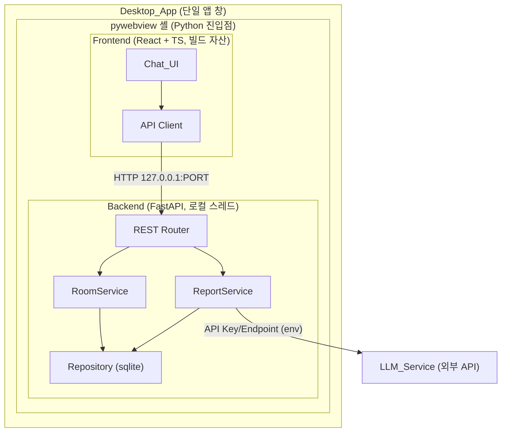
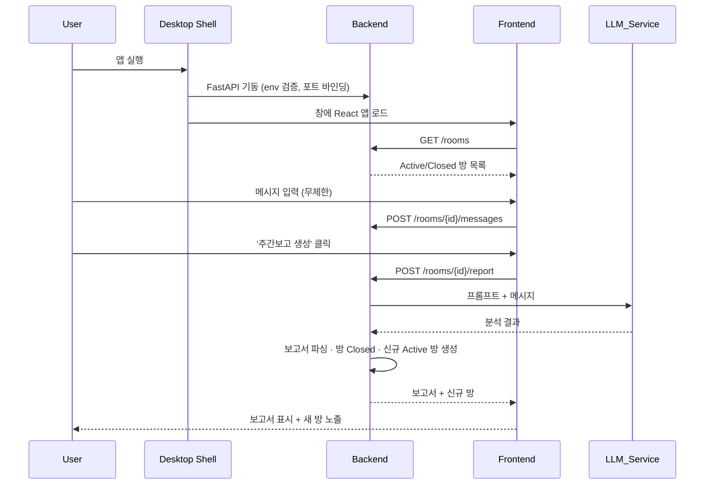
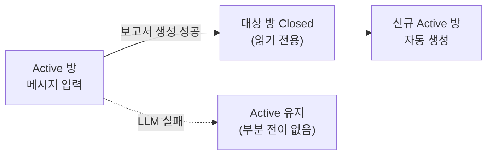
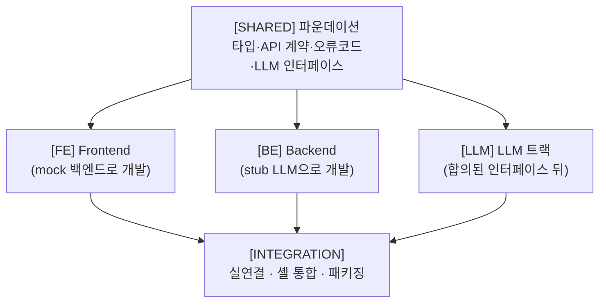
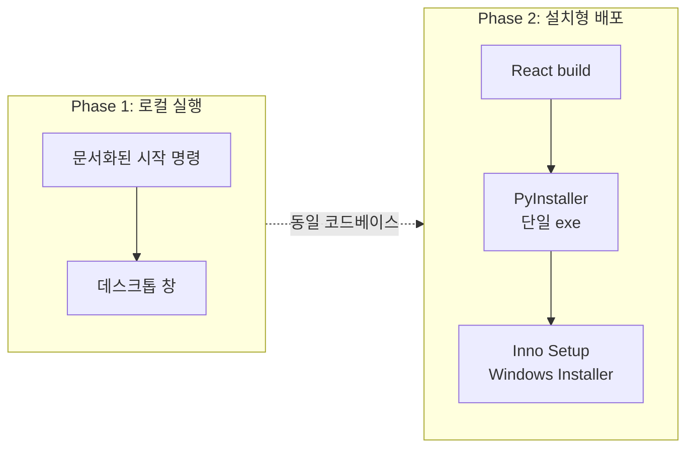

# weekly-report-chat

채팅으로 남기고, 버튼 한 번으로 완성하는 **주간보고 데스크톱 앱**

<!--
발표 스크립트:
- 한 주 동안 채팅하듯 업무를 기록하고, 버튼 하나로 LLM이 주간보고서를 만들어주는 앱입니다.
- 오늘은 왜 만드는지, 어떻게 만드는지, 지금 어디까지 왔는지를 공유합니다.
-->

---

## 오늘 이야기할 것

1. 문제 — 주간보고 작성은 왜 번거로운가
2. 해결 — 채팅 + LLM 자동 생성
3. 제품 형태 — 브라우저가 아닌 데스크톱 앱
4. 아키텍처 — Frontend / Backend / LLM
5. 핵심 흐름 — 실행부터 보고서 생성까지
6. 개발 계획 — 3-트랙 병렬 + 2단계 배포
7. 현재 진행 상황과 다음 단계

---

## 1. 문제 정의

주간보고 작성은 **기억을 되짚고 형식에 맞춰 정리**하는 데 시간이 든다.

- 한 주 동안 한 일을 몰아서 회상해야 한다
- "금주 실적 / 차주 계획 / 이슈" 형식에 억지로 끼워 맞춘다
- 매주 반복되는 정리 작업이 부담이다

> 기록은 편하게, 정리는 자동으로 할 수 없을까?

---

## 2. 해결 방안

**카카오톡처럼 편하게 채팅** → **버튼 클릭** → **LLM이 보고서 생성**

- 형식 없이 자유롭게 업무 내용을 채팅으로 남긴다
- '주간보고 생성' 버튼을 누르면 LLM이 전체 대화를 분석
- 구조화된 주간보고서(작성일 · 금주 실적 · 차주 계획 · 이슈)를 자동 생성
- 로그인 없이 앱을 켜면 바로 사용

---

## 3. 제품 형태 — 데스크톱 앱

브라우저 탭이 아니라, **카카오톡 데스크톱 클라이언트처럼 자체 앱 창**으로 실행된다.

- 사용자는 URL 입력·localhost 접속을 몰라도 된다
- 앱을 켜면 네이티브 창(Application_Window)에 채팅 UI가 뜬다
- 내부적으로 Frontend(React) + Backend(FastAPI)를 하나로 통합
- 데스크톱 셸은 **pywebview** 채택 — 백엔드가 이미 Python이라 단일 언어 스택으로 패키징까지 단순화

---

## 4. 아키텍처 — 전체 구조

외부 통신은 **LLM 호출에만** 한정, FE↔BE는 로컬 루프백(127.0.0.1)으로만 통신

---

## 5. 핵심 흐름 — 실행부터 보고서까지

---

## 6. 데이터 & API 계약

**핵심 데이터 모델**

- `ChatRoom` — active/closed 상태, active 방은 항상 최대 1개
- `Message` — 시간순 저장, 공백 메시지 불가
- `WeeklyReport` — 작성일 · 금주 실적 · 차주 계획 · 이슈 (4개 섹션)

**REST 엔드포인트 5종**

| 메서드 & 경로 | 설명 |
|---|---|
| `POST /rooms` | 새 채팅방 생성 |
| `GET /rooms` | 채팅방 목록 |
| `GET /rooms/{id}/messages` | 메시지 조회 |
| `POST /rooms/{id}/messages` | 메시지 전송 |
| `POST /rooms/{id}/report` | 주간보고 생성 |

---

## 7. 채팅방 라이프사이클

보고서 생성은 **하나의 원자적 트랜잭션**으로 처리한다.

- 성공 시: 보고서 산출 → 방 Closed → 새 Active 방 생성이 한 번에 커밋
- 실패 시: 어떤 상태도 바꾸지 않아 "항상 정확히 하나의 Active 방" 불변식 유지
- Closed 방은 메시지 입력·보고서 생성 모두 거부

---

## 8. 개발 계획 — 3-트랙 병렬

파운데이션(계약)을 먼저 확정하고, 이후 세 트랙이 **서로 의존 없이** 동시 진행

계약(mock/stub)에만 의존 → 실제 연결은 통합 단계에서만 발생

---

## 9. 배포 계획 — 2단계

- **Phase 1** — 개발자 PC에서 로컬 실행, 브라우저 없이 하나의 앱 창으로 전체 기능 검증
- **Phase 2** — 단일 Windows 설치 파일로 배포, 개발 도구 없이 설치·실행·삭제

---

## 10. 품질 전략

- **속성 기반 테스트(PBT)** — 백엔드 핵심 로직 13개 정확성 속성 검증
  - Python Hypothesis / Frontend fast-check, 각 최소 100회 반복
  - 예: "항상 정확히 하나의 Active 방", "공백 메시지는 항상 거부"
- **단위/예시 테스트** — UI 렌더, 오류 경로, 엣지 케이스
- **통합/스모크 테스트** — E2E 보고서 흐름, 설치본 동작, 성능/타이밍

---

## 11. 현재 진행 상황

- ✅ **파운데이션 완료** — 프로젝트 스켈레톤, 공유 타입, REST 계약, 오류 코드, LLM 인터페이스 확정
- ⬜ **다음 단계** — FE / BE / LLM 트랙 실제 구현
- ⬜ 통합 및 pywebview 셸 연결
- ⬜ Phase 2 패키징(PyInstaller + Inno Setup)

> 지금은 "무엇을 어떻게 만들지"가 확정된 상태 → 이제 병렬 구현 착수 단계

---

## 12. 정리

- **문제**: 반복되는 주간보고 작성 부담
- **해결**: 자유 채팅 + LLM 자동 생성
- **형태**: 브라우저 없는 단일 데스크톱 앱 (pywebview)
- **전략**: 계약 우선 → 3-트랙 병렬 → 2단계 배포
- **지금**: 파운데이션 완료, 구현 착수 준비

### 감사합니다 · Q&A
